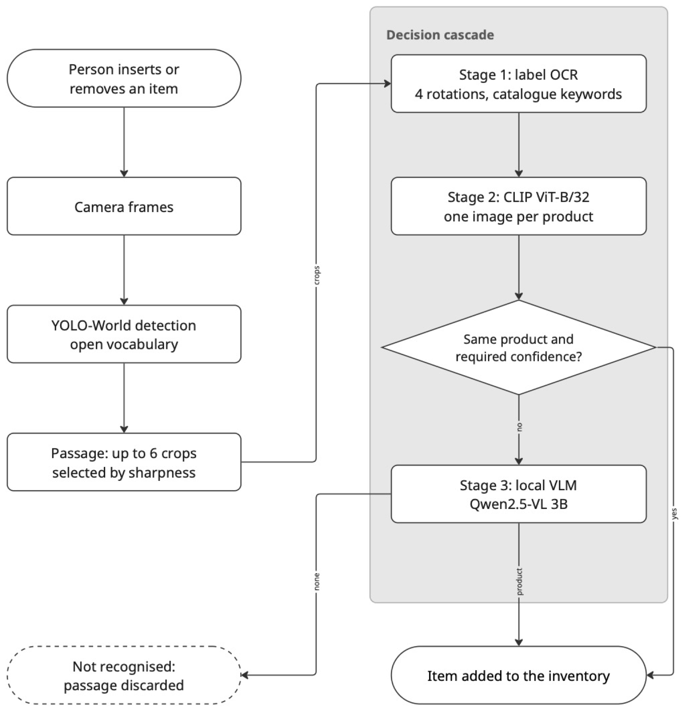

# Smart Fridge — Reconhecimento de Produtos por Câmera Fixa

Sistema de reconhecimento de itens de geladeira e armário usando câmera fixa, sem treinamento de modelos e com uma única imagem de referência por produto.

---

## Introdução

Este repositório é o trabalho da disciplina Projeto de Sistemas Embarcados (IBM3119) do Ibmec. O sistema consiste em uma câmera posicionada sobre a geladeira ou o armário, que reconhece os produtos que entram e saem para automatizar o controle de estoque e a geração de listas de reposição.

A restrição que define o projeto é que o banco de referência tem uma única imagem por produto, como nos catálogos de e-commerce, e nenhum modelo é treinado ou ajustado. Isso aproxima o sistema de um cenário real de cadastro e afasta a solução de datasets construídos com dezenas de fotos por item, tornando o cadastro de novos produtos simples e escalável.

Por ser um projeto acadêmico ligado a um artigo de 3 páginas, as decisões priorizaram baixo custo computacional e facilidade de cadastro. O artigo correspondente está em `artigo/`.

---

## Método



Versão vetorial do diagrama: [figuras/metodo_diagrama_miro.pdf](figuras/metodo_diagrama_miro.pdf)

O pipeline opera em três estágios em sequência dentro de um único processo.

O primeiro estágio é a **detecção**. O detector padrão é o YOLO-World (yolov8s-worldv2), um modelo de vocabulário aberto que aceita descrições textuais de categoria em tempo de execução, sem necessidade de retreino. As categorias incluem tipos genéricos de embalagem (pacote de biscoito, lata de refrigerante, garrafa plástica etc.) e também categorias humanas (pessoa, rosto, mão, braço, roupa, tecido). As detecções humanas são usadas para filtrar: qualquer caixa de embalagem com sobreposição de IoU superior a 0,50 com uma caixa humana é descartada, assim como caixas maiores que 25% da área do quadro. Um filtro adicional de novidade compara a caixa detectada com um quadro de referência da cena vazia: se menos de 15% dos pixels da caixa são novos em relação ao fundo, a detecção é ignorada para evitar que objetos já presentes na cena acionem o pipeline.

O segundo estágio é a **segmentação por passagem**. Quando o detector localiza um produto, o sistema abre uma passagem e acumula quadros enquanto o produto permanece visível. A passagem encerra quando passam 11 quadros consecutivos sem detecção válida, ou quando o produto permanece visível por mais de 60 quadros (limite para evitar acúmulo indefinido). Ao encerrar a passagem, o sistema seleciona até 6 recortes ordenados pela nitidez medida pela variância do Laplaciano e toma uma única decisão para toda a passagem.

O terceiro estágio é a **cascata de identificação**, composta por três métodos em ordem crescente de custo:

1. **OCR do rótulo** (Apple Vision). Cada recorte é ampliado 2x por interpolação cúbica, convertido para escala de cinza, equalizado por CLAHE (clipLimit 2,0, grade 8×8) e agudizado por unsharp mask. O OCR roda nas quatro rotações do recorte (0°, 90°, 180°, 270°) e escolhe a orientação com mais caracteres alfanuméricos. O texto obtido é casado com um índice de palavras-chave construído a partir de `catalogo_palavras.yaml`, que retém apenas palavras presentes em exatamente um produto do catálogo — palavras compartilhadas entre produtos são descartadas automaticamente. O OCR decide a passagem se encontrar uma palavra longa (≥ 5 caracteres) ou pelo menos duas palavras distintas apontando para o mesmo produto.

2. **CLIP ViT-B/32** (similaridade de cosseno). O embedding do recorte mais nítido é comparado com os embeddings de todas as imagens do catálogo. O CLIP decide se a maior similaridade supera 0,66 e a margem entre o primeiro e o segundo colocados supera 0,05. Abaixo de 0,50, a passagem é descartada sem acionar o VLM; entre 0,50 e 0,66, o recorte é encaminhado ao VLM.

3. **VLM local Qwen2.5-VL 3B** (via Ollama). Acionado quando os dois métodos anteriores não chegam a uma decisão, ou quando OCR e CLIP concordam cada um em um produto diferente. O VLM recebe o recorte redimensionado para 896 px no lado maior e um prompt estruturado com a lista de produtos do catálogo e suas descrições em português. A resposta deve conter duas linhas — `TEXTO:` com o texto lido no rótulo e `PRODUTO:` com o identificador exato da lista. A validação cruzada consiste em verificar se o identificador respondido pertence ao catálogo; se o campo PRODUTO retornar "nenhum" mas o campo TEXTO contiver conteúdo, o sistema tenta casar o texto com o índice de palavras-chave. O VLM é processado em fila assíncrona por um único worker em thread separada, com no máximo um pedido ativo por passagem e uma segunda tentativa com o recorte seguinte em caso de falha.

---

## Hardware utilizado

Todo o processamento roda em um MacBook Air com Apple Silicon. A câmera é um iPhone conectado por Continuity Camera (AVFoundation), selecionado automaticamente pelo sistema ou pelo nome via `--camera-nome`. Nesta etapa do projeto, captura e processamento operam na mesma máquina. A arquitetura prevista para a próxima etapa separa a captura em um módulo dedicado com microcontrolador, transmitindo as imagens por rede para o host de processamento.

---

## Software e modelos

**Python 3.9+** com ambiente virtual isolado.

| Biblioteca | Função |
|---|---|
| `opencv-python` | Captura de vídeo, manipulação de imagens, pré-processamento OCR, nitidez por Laplaciano |
| `open-clip-torch` | CLIP ViT-B/32, cálculo de embeddings de imagem |
| `torch` | Backend PyTorch; aceleração por MPS no Apple Silicon |
| `Pillow` | Leitura de imagens para o CLIP |
| `numpy` | Álgebra linear, similaridade de cosseno, operações em arrays |
| `pyyaml` | Leitura de `config.yaml`, `catalogo_palavras.yaml`, `catalogo_descricoes.yaml` |
| `requests` | Download de imagens do Open Food Facts em `baixar_catalogo.py` |
| `ultralytics` | YOLO-World (instalação opcional; o sistema cai para detector por diferença de fundo se ausente) |
| `pyobjc-framework-Vision` | OCR via Apple Vision (VNRecognizeTextRequest); requer macOS |
| Ollama | Serviço local que hospeda o Qwen2.5-VL 3B; instalado separadamente |

**Modelos utilizados:**

| Modelo | Papel no sistema | Observação |
|---|---|---|
| YOLO-World yolov8s-worldv2 | Detecção de produtos e filtragem de partes do corpo | Vocabulário aberto; categorias configuradas em `YOLO_CLASSES` em `demo_ao_vivo.py` |
| CLIP ViT-B/32 laion2b\_s34b\_b79k | Segundo estágio da cascata de identificação | Embedding comparado por cosseno com o catálogo |
| Apple Vision (VNRecognizeTextRequest) | OCR do rótulo, primeiro estágio da cascata | Precisa de macOS; pt-BR + en-US no nível "accurate" |
| Qwen2.5-VL 3B | Terceiro estágio da cascata, arbitragem por linguagem visual | Servido localmente pelo Ollama; acionado apenas quando os outros dois não decidem |

Nenhum dos modelos foi treinado ou ajustado para este projeto. Todos são usados com os pesos pré-treinados originais.

---

## Catálogo

O catálogo é composto por três artefatos:

- `catalogo/` — uma imagem JPG por produto, com o identificador do produto como nome de arquivo (ex.: `coca_zero.jpg`). As imagens são baixadas do Open Food Facts por `baixar_catalogo.py` ou copiadas manualmente de `catalogo_manual/`.
- `catalogo_palavras.yaml` — palavras-chave por produto para o OCR. Ao carregar, o sistema remove automaticamente palavras presentes em mais de um produto para evitar ambiguidade.
- `catalogo_descricoes.yaml` — descrição curta de cada produto em português, usada no prompt enviado ao VLM.

**Para adicionar um produto novo:**

1. Localize o código de barras do produto.
2. Adicione uma linha ao `produtos.csv` com o código e o nome de arquivo desejado (sem extensão, sem acento, sem espaço).
3. Execute `python baixar_catalogo.py` para baixar a imagem do Open Food Facts.
4. Abra `catalogo_palavras.yaml` e acrescente uma entrada com palavras que aparecem apenas neste produto (marca, sabor específico, termos do rótulo).
5. Abra `catalogo_descricoes.yaml` e acrescente uma descrição curta em português para o prompt do VLM.
6. Reinicie a demo.

Alternativamente, coloque a imagem JPG diretamente em `catalogo_manual/` com o nome desejado e rode `python baixar_catalogo.py` para copiá-la para `catalogo/`.

---

## Instalação e execução

```bash
# Instala as dependências no perfil do usuário (Python 3.9 do sistema — modo usado no desenvolvimento)
pip install --user -r requirements.txt
pip install --user ultralytics
pip install --user pyobjc-framework-Vision pyobjc-framework-AVFoundation

# Alternativa recomendada: ambiente virtual isolado (evita conflitos com outros projetos)
# python3 -m venv .venv
# source .venv/bin/activate
# pip install -r requirements.txt
# pip install ultralytics pyobjc-framework-Vision pyobjc-framework-AVFoundation

# Baixa as imagens do catálogo (requer produtos.csv preenchido)
python baixar_catalogo.py

# Sobe o VLM local (necessário apenas com --vlm)
ollama pull qwen2.5vl:3b
nohup ollama serve > ~/ollama.log 2>&1 &

# Executa a demo ao vivo
python demo_ao_vivo.py

# Flags disponíveis
python demo_ao_vivo.py --detector yolo       # YOLO-World (padrão)
python demo_ao_vivo.py --detector fundo      # diferença de fundo
python demo_ao_vivo.py --direcao nenhum      # decisão por estabilidade (padrão)
python demo_ao_vivo.py --direcao area        # direção por tamanho aparente
python demo_ao_vivo.py --direcao linha       # direção por cruzamento de linha
python demo_ao_vivo.py --camera 1            # índice de câmera explícito
python demo_ao_vivo.py --camera-nome iPhone  # seleciona câmera pelo nome AVFoundation
python demo_ao_vivo.py --listar-cameras      # lista câmeras disponíveis
python demo_ao_vivo.py --com-enriquecido     # inclui referências de catalogo_enriquecido/
python demo_ao_vivo.py --vlm                 # ativa o terceiro estágio (Qwen2.5-VL 3B)
python demo_ao_vivo.py --sem-frutas          # desativa a via de hortifruti/YOLO direto

# Processamento offline das capturas para avaliação
python processar_capturas.py
python processar_capturas.py --sessao logs_demo/20260921_143000
python processar_capturas.py --gerar-palavras-yaml   # regenera catalogo_palavras.yaml
```

**Teclas durante a demo:** `q` sair · `b` capturar fundo · `d` ligar/desligar detecção automática · `+`/`-` ajustar limiar · `<`/`>` ajustar margem · `a`/`s` adicionar/remover produto manualmente · `r` zerar inventário · `c` salvar recorte enriquecido · `Espaço` salvar recorte de teste.

---

## Saídas geradas

| Diretório | Conteúdo |
|---|---|
| `logs_demo/` | Log de sessão em texto (um por execução) e recortes de eventos e detecções ambíguas |
| `capturas/` | Recortes por passagem (`passagem_NNN/recorte_a.jpg` … `recorte_f.jpg`) e metadados JSON de cada passagem |
| `relatorios/` | Relatório de sessão em texto com detalhes de cada passagem, decisão por método e resumo final |
| `inventario/` | JSON com o estado do inventário e CSV com todos os eventos (entrada/saída) registrados na sessão |
| `resultados/` | CSV de saída do processamento offline (`processar_capturas.py`), com colunas de CLIP, OCR e VLM por recorte |

---

## Resultados obtidos

Os números abaixo vêm dos relatórios em `relatorios/`.

**Sessão de avaliação** (catálogo com 6 produtos, 5 produtos apresentados fisicamente):

| Passagens | Decisões | Acertos | Decidido por OCR | Decidido por CLIP | Decidido por VLM |
|---:|---:|---:|---:|---:|---:|
| 22 | 20 | 19 (95%) | 9 | 10 | 1 |

**Sessão de demonstração** (5 produtos apresentados):

| Produtos | Passagens | Acertos |
|---:|---:|---:|
| 5 | 5 | 5 (100%) |

---

## Caminhos testados e descartados

| Abordagem | Motivo do descarte |
|---|---|
| Subtração de fundo com MOG2 | Produto parado na cena desaparece da máscara após alguns quadros |
| Direção pela variação de área aparente | O sentido de entrada/saída ficou invertido com câmera de topo |
| Seleção do recorte por nitidez pura | Premiava o fundo texturizado em vez do produto em movimento |
| CLIP como único método de identificação | Efeito de atrator: recortes escuros caíam consistentemente no mesmo produto do catálogo |
| VLM sem validação da resposta | Respondeu produto sem conseguir ler o rótulo; necessário cruzar PRODUTO com TEXTO |

---

## Limitações conhecidas

- O índice de palavras-chave não escala para centenas de produtos; palavras compartilhadas são eliminadas, reduzindo a cobertura à medida que o catálogo cresce.
- O rótulo precisa estar voltado para a câmera para que o OCR funcione; na orientação oposta, o sistema depende apenas do CLIP ou do VLM.
- O VLM leva dezenas de segundos por imagem; em demonstrações rápidas, a resposta pode chegar depois que o produto já saiu do campo de visão.
- Entrada e saída não são distinguidas automaticamente; todo reconhecimento por passagem é registrado como entrada no inventário.

---

## Autoria

Letícia Valladão e Vinicius Dias  
IBM3119 Projeto de Sistemas Embarcados — Ibmec  
Professor: Rigel Procópio Fernandes
